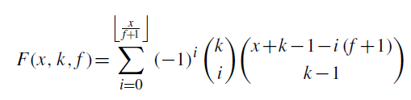

# Utility functions

## Description

It contains utility functions such as binomial coefficient, factorial, k-permutations, multinomial-coefficient, stars-and-bars, possible ways of distributing resources.

### Possible ways of distributing resources using star-and-bars and the iclusion-exclusion principles.

More around the binomial coefficient, factorial, k-permutations, multinomial-coefficient, stars-and-bars, please visit
<a href="https://docs.google.com/presentation/d/1aUBEpuPIW2BwpPYpkyzhyvDtzDBKiJyzOHfzVT5uiuE/edit#slide=id.g8189cfd6e4_0_55" target="_blank"> Probability, More Counting by Alex Tsun and Matthew Taing
</a>

More around the Inclusion-Exclusion principle, please visit
<a href="https://medium.com/@m.pierini/graphically-understanding-the-inclusion-exclusion-principle-de7e54ebb8bb" target="_blank">Graphically understanding the Inclusion-Exclusion Principle by Massimo Pierini
</a>
